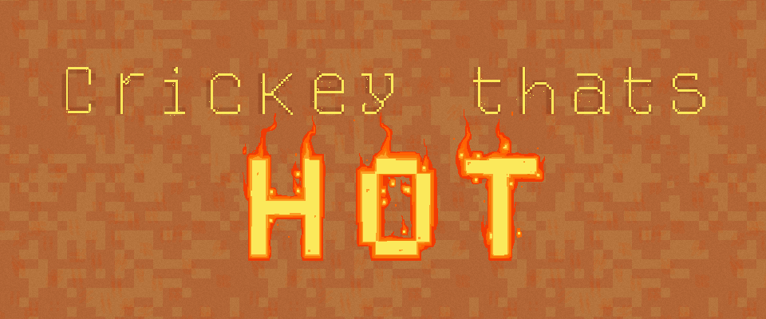

  

  
## About
  
This game was created as part of a 2 weeks jam, for the Gaming Jam class of Bezalel Academy of Arts and Design.
  
Inspired by climate change and the forest fires in Australia, "Crikey that's Hot!" lets you play as a ranger in the outback of Australia on a mission to save as many koala bears as possible, put out forest fires and avoid death before everything burns down.

## Download

  

## Credits

Developers: Eran Kramf, Roi Shacham.

Designers: Shachar Shomer, Yuval Flayshman.
